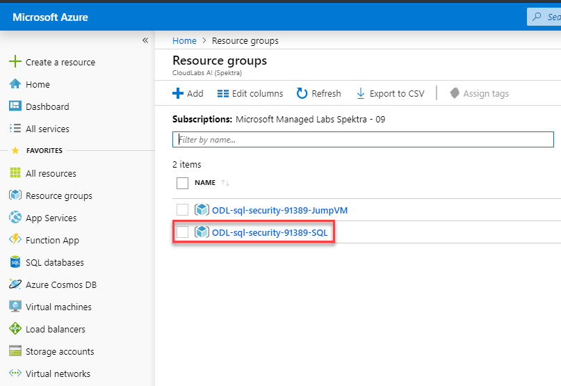
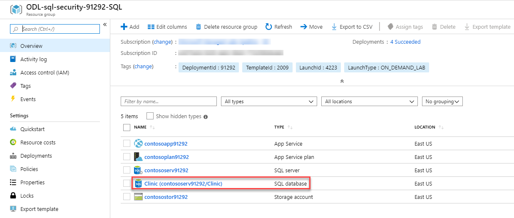
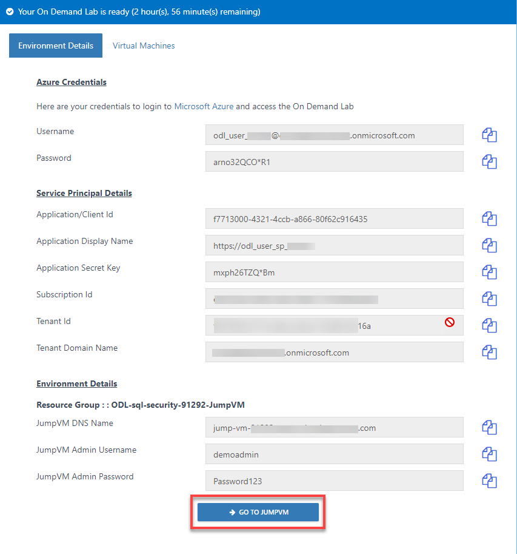
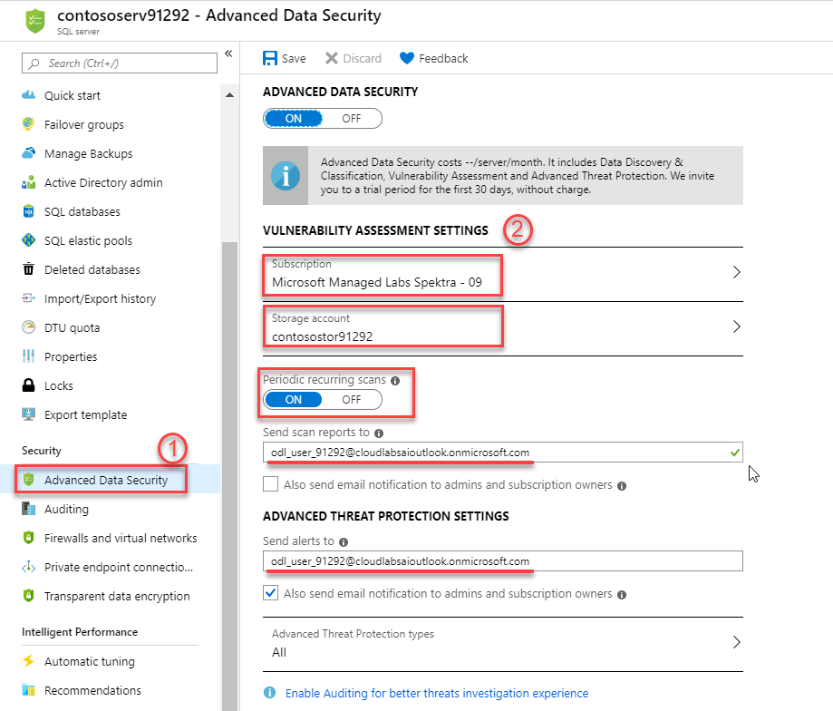
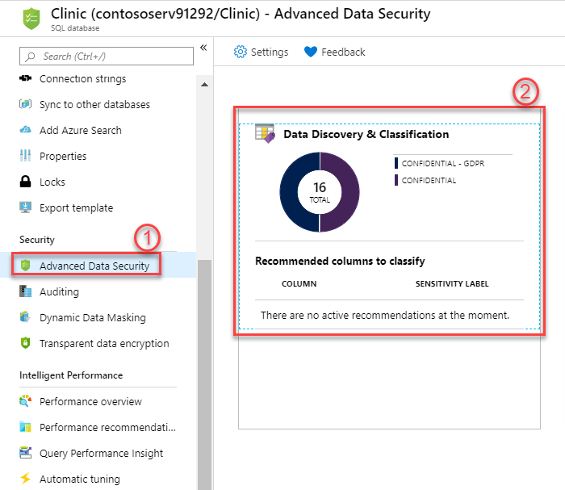
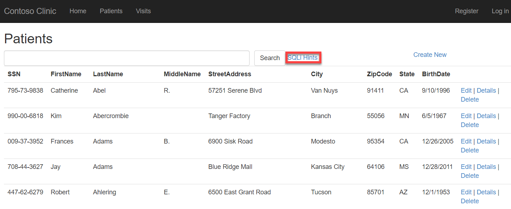
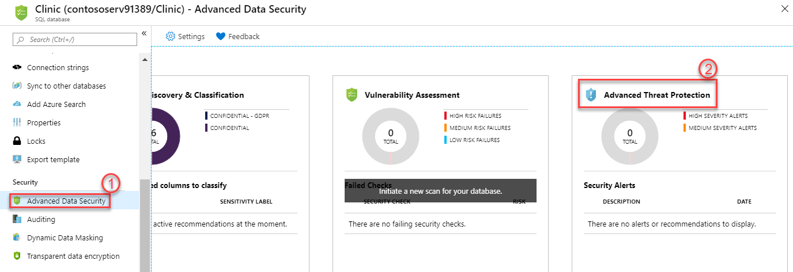

# Azure-SQL-Database-Security-Demo

## Overview
___________________

**Contents**

  - [Exercise 1: Getting Started](./README.md#exercise-1-perform-database-assessments)
    - [Task 1: Review Azure SQL Database](./README.md#task-1-review-azure-sql-database)
  - [Exercise 2: Control Access](./README.md#exercise-2-control-access)
    - [Task 1:Configure Azure AD Login for your Azure SQL DB](./README.md#task-1-configure-azure-ad-login-for-your-azure-sql-db)
    - [Task 2: Access the Database using SQL Server Management Studio](./README.md#task-2-access-the-database-using-sql-server-management-studio)
  - [Exercise 3: Protect Data](./README.md#exercise-3-protect-data)
    - [Task 1: Transparent Data Encryption](./README.md#task-1-transparent-data-encryption)
    - [Task 2: Auditing](./README.md#task-2-auditing)
    - [Task 3: Threat Protection](./README.md#task-3-threat-protection)
    - [Task 4: Configure SQL Data Discovery and Classification](./README.md#task-4-configure-sql-data-discovery-and-classification)
    - [Task 5: Simulate Attack](./README.md#task-5-simulate-attack)
    - [Task 6: Vulnerability Scan](./README.md#task-6-vulnerability-scan)
    - [Task 7: Configure Dynamic Data Masking](./README.md#task-7-configure-dynamic-data-masking)
    - [Task 8: Verify data how does it look by using App](./README.md#task-8-verify-data-how-does-it-look-by-using-app)
 
## Exercise 1: Perform database assessments

### Task 1: Review Azure SQL Database

1. In the Azure Portal, navigate to the Resource Groups. There are two resource groups, select the resource group with suffix **-SQL**.

2. Locate a resource named **Clinic**. This is your **Azure SQL Database**.

## Exercise 2: Control Access

### Task 1: Configure Azure AD Login for your Azure SQL DB

1. Login into the Azure Portal, open **Resource Group** with suffix **-SQL**, navigate to the SQL Server.
1. Under the **Settings** blade, select **Active Directory Admin**. Here you can review your username registered as Active Directory Admin.

### Task 2: Access the Database using SQL Server Management Studio

1. Now, login to **JumpVM** by clicking on **GO TO JumpVM** button on lab details page. 

2. On start bar, search SQL and select **Microsoft SQL Server Management Studio 18**.
3. Use the following configurations then click Connect:
* Server name: enter the server name which you can copy from the overview page of SQL Server at the top right corner.

* authentication method: from dropdown select **Active Directory-Password**
* username: **odl_user_xxxxx@xxxxxxxxxxx.onmicrosoft.com**
* password: **arno32QCO*R1**

**iii.	You will get a login failure which will be due to the Firewall rules Image
iv.	Go back to SQL server, under security blade select Firewalls and virtual networks.?????
v.	Should we show a login failure first and then add firewall IP? 
vi.	Show the login failure due to firewall then add the rule.**

## Exercise 3: Protect Data 

### Task 1: Transparent Data Encryption 

Transparent data encryption (TDE) helps protect Azure SQL Database against the threat of malicious offline activity by encrypting data at rest. It performs real-time encryption and decryption of the database, associated backups, and transaction log files at rest without requiring changes to the application

1. In the Azure Portal, go to Resource Group with suffix **-SQL**, select the SQL Database **Clinic**.
2. Select **Transparent data encryption** under the Security blade.
3. Here you can review; transparent data encryption is already enabled. 

### Task 2: Auditing 

1. In SQL Database, under Settings select **Auditing** where you can review that Auditing is enabled and data is being stored in your storage account.
2. Click on **View Audit Logs**, this will show all the database activities happened recently.

### Task 3: Threat Protection 
1. Open Resource Group with suffix **-SQL**, navigate to the SQL Server. Select **Advanced Data Security** under Security.
2. Use the following configurations:
* Advanced Data Security: **On**
* Subscription: **Choose your subscription**
* Storage Account: **Choose your storage account**
* Periodic recurring scans: **On**
* Send scan reports to: **username**
* Send Alerts to: **username**

3. Select **Save**.

### Task 4: Configure SQL Data Discovery and Classification

In this task, you will look at the SQL Data Discovery and Classification feature that introduces a new tool for discovering, classifying, labeling & reporting the sensitive data in your databases. It introduces a set of advanced services, forming a new SQL Information Protection paradigm aimed at protecting the data in your database.

1. Go to SQL Database, On the **Advanced Data Security** blade, select the **Data Discovery & Classification** tile.

2. In the Data Discovery & Classification blade, select the info link with the message **We have found 16 columns with classification recommendations**.

3. Look over the list of recommendations to get a better understanding of the types of data and classifications that can be assigned, based on the built-in classification settings.
4. Check the **Select all** check box at the top of the list to select all the remaining recommended classifications, and then select **Accept selected recommendations**.

5. Select **Save**.
6. When the save completes, select the **Overview** tab on the Data Discovery & Classification blade to view a report with a full summary of the database classification state.

**Verify by running SQL Query**

### Task 5: Simulate Attack 

1.	In the Azure Portal, open Resource Group with suffix **-SQL**, navigate to the app service **contosoapp-suffix** and select **Browse**.

2.	You will be directed to **Contoso Clinic** webpage, select **Patients**, 

3.	Select **SQLi Hints**.

4.	You will see SQL ingestions that will result into an attack.

.png)

5.	Pick one of them and paste in the search box and select Search.

6.	Now go back to SQL Database **Clinic**, select **Advanced Data Security** under Security blade.
7.	Select **Advanced Threat Protection**.

8. Here you can review the alert , also this will be shown as a threat. It will take few minutes to get fetched.

### Task 6: Vulnerability Scan

The SQL Vulnerability Assessment service is a service that provides visibility into your security state, and includes actionable steps to resolve security issues, and enhance your database security.

1.	Return to the **Advanced Data Security** blade and then select the **Vulnerability Assessment** tile.
1.	On the Vulnerability Assessment blade, select **Scan** on the toolbar.
1.	When the scan completes, you will see a dashboard, displaying the number of failing checks, passing checks, and a breakdown of the risk summary by severity level.
1.	__________

1.	Run a SQL Injection Alert 
1.	You'll receive an email with security alert (lab user has mailbox) 
1.	Review the security alerts in ATP 
1.	Review Audit Logs
1.	Run a Vulnerability Scan and review results. 

### Task 7: Configure Dynamic Data Masking: 
 
In this exercise, you will enable Dynamic Data Masking (DDM). DDM limits sensitive data exposure by masking it to non-privileged users. This feature helps prevent unauthorized access to sensitive data by enabling customers to designate how much of the sensitive data to reveal with minimal impact on the application layer. It’s a policy-based security feature that hides the sensitive data in the result set of a query over designated database fields, while the data in the database is not changed.

1. Add a mask by navigating to SQL Database, on the **Advanced Data Security** blade, go to **Dynamic Data Masking** and select **+Add Mask**.

2. Use following configurations:
* Schema: **dbo**
* Table: select **Patients** from dropdown
* Column: **SSN (char)** from dropdown

3. Select **Add**.
4. Add a mask again by selecting **+Add Mask**.
5.  Use following configurations:
* Table: select **Visits** from dropdown
* Column: **PatientID (int)** from dropdown
* Masking field format: **Number (random number range)** [From: 0 – To: 100]

6. Select **Add**.

### Task 8: Verify data how does it look by using App
1. Go back to your app service, select **Visits**.
