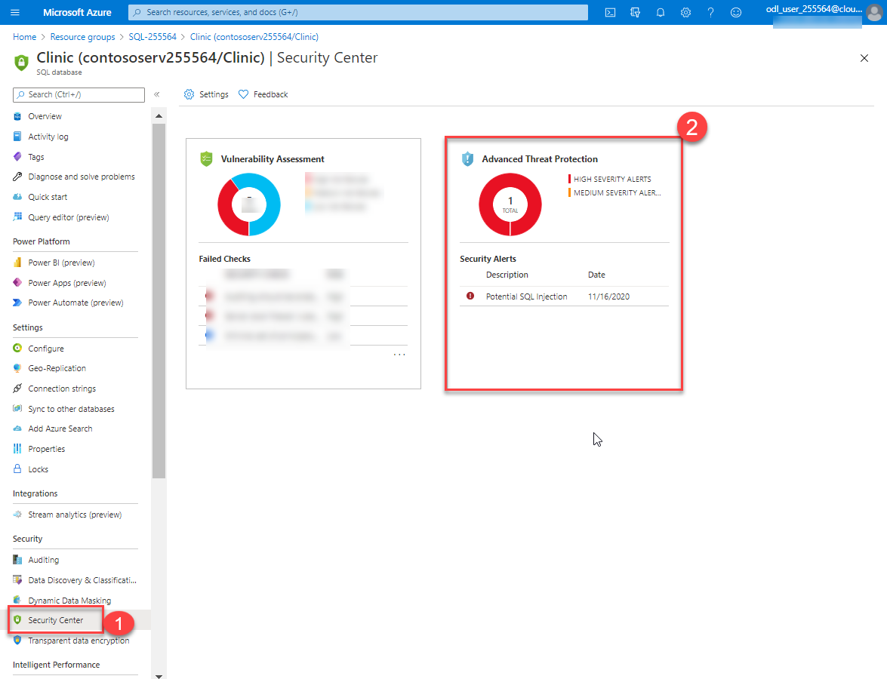

# Azure-SQL-Database-Security-Demo

## Overview
Security is a top concern for managing databases, and it has always been a priority for Azure SQL Database. Your databases can be tightly secured to help satisfy most regulatory or security requirements. 

In this demo, We'll walkthrough some of the Security features of Azure SQL Databases. 
 
## Exercise 1: Getting Started

This exercise will help you getting access to demo environment and getting started with demo lab environment. 

   * [Task 1: Sign Up for Pre-configured Environment](#exercise-01-sign-up-for-pre-configured-environment)
   * [Task 2: Log into your Azure Portal and Verify access to the Lab Environment](#exercise-02-log-into-your-azure-portal-and-verify-access-to-the-lab)
 

### Task 1: Sign Up for pre configured environment

1.	Once you launch the demo environment, you'll see environment details as demonstratedsoon below.<br/>


2. Please ensure to use provided Azure Credentials during the course of Lab. There's a pre-provisioned SQL Database provided, FQDN of the demo environment is also available in details. 


### Task 2: Log into your Azure Portal and Verify access to the Lab

In this exercise, you will log into the **Azure Portal** using your Azure credentials. We'll be using the Jump Virtual machine provided for completing this demo. 

1. Login to **JumpVM** by clicking on **GO TO JumpVM** button on lab details page. 


2.  Open Azure Portal by launching shortcut from the desktop.


3.  Enter the **Username** which was displayed in the previous window and click on **Next**.<br/>


4. Enter the **Password** and click on **Sign in**.<br/>


5.	In the Welcome to **Microsoft Azure** pop-up window, click **Maybe Later**. Now you have login successfully.


6. You will see one Resource Group on which you have access. 

7. Click on **SQL-XXXXX** Resource Group which contains the pre-deployed Azure SQL Database as shown below. Your demo environment includes a pre-created Azure SQL Database named "Clinic", loaded witha  sample data. It also includes a sample application to use through the demo hosted in an Azure App Service. 


## Exercise 1: Control Access

### Task 1: Configure Azure AD Login for your Azure SQL DB

Azure AD authentication is a mechanism of connecting to Azure SQL Database and SQL Data Warehouse by using identities in Azure AD. With Azure AD authentication, you can manage the identities of database users and other Microsoft services in one central location. Central ID management provides a single place to manage database users and simplifies permission management. Let us enable Azure AD based authentication for your Azure SQL database.


1. Login into the Azure Portal, open **Resource Group** with prefix **SQL-XXXXX**, navigate to the SQL Server **contososerv-suffix**.

2. Under the **Settings** blade, select **Active Directory Admin**. Here you can review your username registered as Active Directory Admin. Using this you can login to SQL Server using your AAD Credentials itself.  


### Task 2: Access the Database using SQL Server Management Studio

In this task, We'll try accessing our **Clinic** database using SQl Server Management Studio with Azure AD Authentication

1. Launch **Microsoft SQL Server Management Studio 18** from the desktop.

2. Use the following configurations then click Connect:
* Server name: enter the server name which you can copy from the overview page of SQL Server at the top right corner.


* authentication method: from dropdown select **Active Directory-Password**
* username: **odl_user_xxxxx@xxxxxxxxxxx.xxxxxxxxxxx.com**
* password: **youruniquepassword**


3.	You will get a login failure which will state: ***Your client IP address does not have access to the server. Sign in to an Azure Account and create a new firewall rule to enable access.*** We need to add firewall rule to allow access to Azure SQL Database from our machine. 


### Task 3: Configure Azure SQL Database Firewall
To provide access security, SQL Database controls access with Firewall rules that limit connectivity by IP address. You can choose to allow specific IPs for database access and also enable other Azure Services by just enabling Azure Service Access. Let us create firewall rules to enable access to the database. 

1. In Azure Portal, browse to your SQL Server **contososerv-suffix**.

2. Select **Firewall and virtual networks**. Then select **ON** for **Allow Access to Azure Services** to enable firwall, then add fiirwall IP that ranges between the **Client IP address** you see in you sql server. 


3.**Save** the changes.


4. Now you can try logging in using SQL Server Management Studio and it should work as expected. Also you can review you SQL Database **Clinic** by expanding **Database** 


## Exercise 3: Protect Data 

SQL Database secures customer data by providing auditing and threat detection capabilities.

### Task 1: Transparent Data Encryption 

Transparent data encryption (TDE) helps protect Azure SQL Database against the threat of malicious offline activity by encrypting data at rest. It performs real-time encryption and decryption of the database, associated backups, and transaction log files at rest without requiring changes to the application

1. In the Azure Portal, go to Resource Group with suffix **-SQL**, select the SQL Database **Clinic**.
2. Select **Transparent data encryption** under the **Security** blade.
3. Here you can review; transparent data encryption is already enabled. 


### Task 2: Always Encryption
Always Encrypted is a feature designed to protect sensitive data, such as credit card numbers or national identification numbers (for example, U.S. social security numbers), stored in Azure SQL Database or SQL Server databases. Always Encrypted allows clients to encrypt sensitive data inside client applications and never reveal the encryption keys to the Database Engine ( SQL Database or SQL Server). As a result, Always Encrypted provides a separation between those who own the data (and can view it) and those who manage the data (but should have no access). By ensuring on-premises database administrators, cloud database operators, or other high-privileged, but unauthorized users, cannot access the encrypted data, Always Encrypted enables customers to confidently store sensitive data outside of their direct control. This allows organizations to encrypt data at rest and in use for storage in Azure, to enable delegation of on-premises database administration to third parties, or to reduce security clearance requirements for their own DBA staff.

In this demo, Always encryption is already enabled for one sample column in **dbo.visits table**. Let us verify. 

1. In SQL Server Management Studio, select your database **Clinic** > **Tables** > **dbo.Visits** > **Encrypt Columns**.


2. You will get a pop-up window, where you will enable encryption. So select **Next**.


3. Here you'll see the column named "Reason" is already encrypted.


4. Now, Let us cancel this wizard and verify that it works by running a query in SQL Server Management Studio. 

5. In SQL Server Management Studio, select your database **Clinic** > **Tables** > **dbo.Visits** > right click and Select **Select top 1000 rows**.  Notice that Reason column have encrypted data. 


### Task 2: Enable Advanced Data Security for Azure SQL Database
Advanced data security is a unified package for advanced SQL security capabilities. It includes functionality for discovering and classifying sensitive data, surfacing and mitigating potential database vulnerabilities, and detecting anomalous activities that could indicate a threat to your database. It provides a single go-to location for enabling and managing these capabilities.

Let us enable Azure Advanced Data Security for our Clinic Database Server. 

1. Open Resource Group with prefix **SQL-**, navigate to the SQL Server. Select **Security Center** under **Security**.
2. Use the following configurations:
* Subscription: **Choose your subscription**
* Storage Account: **Choose your existing storage account**
* Periodic recurring scans: **On**
* Send scan reports to: **username** (Your user login username)
* Send Alerts to: **username**


3. Select **Save**.

### Task 3: Simulate Attack 
In this task, We'll try to simulate a SQL Injection attack on our database and see how Azure Advanced Data Security reacts to it. 

1.	In the Azure Portal, open Resource Group with suffix **-SQL**, navigate to the app service **contosoapp-suffix** and select **Browse**.


2.	You will be directed to **Contoso Clinic** webpage, select **Patients**, 


3.	In the **Search Box**, put the following code and  click on **Search**. You can also copy this from the web page by clicking on **SQLi Hints** and copying 3rd command.
```
    
' UNION SELECT '0', '1', '2', STUFF((select name from sys.tables FOR XML PATH('')),1,1,''), '4', '5', '6', '7', '8', '2010-10-10' --

```


4. This will perform a SQL Injection in the database. Azure SQL Security should detect and notify you about the threat on the email address you provided in last step. 

5. Let us check if you recevied an email about it. You can open  https://portal.office.com in another tab in your browser. Login with same Azure Credentials you used to login to azure portal. 

6. Select **Outlook**. This will prompt to configure time zone, you can configure your local time zone and continue. 


7. Then review the email which shows details about the threat.


8.	Also, you can review threat alerts in **Azure Portal**. To check through the portal, go to SQL Database **Clinic**.
9. Open **Security Center** under Security blade, select **Advanced Threat Protection**. Here you can review the threat alert.


 
10. Select the **Potential SQL Injcetion**.


11. Here is the database in which threat is found. Select the sql database **Clinic**.


12. In this section you can review additional details about the threat. 


13. At the top right corner, you should also see the investigation steps for the attack.


### Task 4: Auditing
Auditing an instance of the SQL Server Database Engine or an individual database involves tracking and logging events. For SQL Server, you can create audits that contain specifications for server-level events and specifications for database-level events. Audited events can be written to the event logs or to audit files. Let us enable Auditing for our SQL Db. 

1. In SQL Database, select **Auditing** under **Security** where you can review that Auditing is enabled and audit data is being stored in your storage account.


2. Click on **View Audit Logs**, this will show all the database activities happened recently. You can click on the audit log to review  additional details of any activity. 


### Task 5: Configure SQL Data Discovery and Classification

In this task, you will look at the SQL Data Discovery and Classification feature that introduces a new tool for discovering, classifying, labeling & reporting the sensitive data in your databases. It introduces a set of advanced services, forming a new SQL Information Protection paradigm aimed at protecting the data in your database. Let's get started.

1. In Azure Portal, open your SQL Database and select the **Data Discovery & Classification** blade under Security.


2. In the Data Discovery & Classification blade, select the info link with the message **We have found 16 columns with classification recommendations**.


3. Look over the list of recommendations to get a better understanding of the types of data and classifications that can be assigned, based on the built-in classification settings.

4. Check the **Select all** check box at the top of the list to select all the remaining recommended classifications, and then select **Accept selected recommendations**.


5. Select **Save**.
6. When the save completes, select the **Overview** tab on the Data Discovery & Classification blade to view a report with a full summary of the database classification state.

7. Data classifications is now enabled and will be available in audit logs as well, Let us perform some data access operations using the sample app to review the audit logs with data classifications.

8. In Azure Portal, browse to the app service named **contosoapp-suffix**.

8. Select **Browse**, this will open **Contoso Clinic** webpage.


9. Now navigate to **Patients**. Then perform an operation by selecting **Details** of any patient . 


10. The actions performed on the webpage will directly get logged into audit logs which can be reviewed. 

11. In SQL Database **Clinic**, select **Auditing** under **Security** where you can review the audit logs. Select **View Audit Logs**.

 

12. You can review the recently created activities.


13. Click on the activity which has the prinicpal name as **demoadmin** and the Event type as **BATCH COMPLETED**, which will further show you details about the operation you performed in previous step (Step 9). It will show classification of the data accessed in last transaction.


### Task 6: Vulnerability Scan

In this task, you will review an assessment report generated by ADS for the `Clicnic` database and take action to remediate one of the findings in the `TailspinToys` database. The [SQL Vulnerability Assessment service](https://docs.microsoft.com/azure/sql-database/sql-vulnerability-assessment) is a service that provides visibility into your security state, and includes actionable steps to resolve security issues, and enhance your database security. 

1. Return to the **Security center** blade for the **Clinic** database and then select the **Vulnerability Assessment** tile.


2. On the Vulnerability Assessment blade, select **Scan** on the toolbar.


3. When the scan completes, you will see a dashboard, displaying the number of failing checks, passing checks, and a breakdown of the risk summary by severity level.

 

4. In the scan results, take a few minutes to browse both the Failed and Passed checks, and review the types of checks that are performed. In the **Passed** list, locate the security check for **Transparent data encryption**. This check has an ID of **VA1219**.


5. Select the **item** finding to view the detailed description.


### Task 7: Configure Dynamic Data Masking: 
 
In this exercise, you will enable Dynamic Data Masking (DDM). DDM limits sensitive data exposure by masking it to non-privileged users. This feature helps prevent unauthorized access to sensitive data by enabling customers to designate how much of the sensitive data to reveal with minimal impact on the application layer. It’s a policy-based security feature that hides the sensitive data in the result set of a query over designated database fields, while the data in the database is not changed.

1. Now navigating to SQL Database **Clinic** to add a mask.
2. Go to **Dynamic Data Masking** under **Security** blade, then select **+Add Mask**.


3. Use following configurations to create a mask rule:
* Schema: **dbo**
* Table: select **Patients** from dropdown
* Column: **SSN (char)** from dropdown


4. Select **Add**.

5. Add a mask again by selecting **+Add Mask**.
6. Use following configurations:
* Table: select **Visits** from dropdown
* Column: **PatientID (int)** from dropdown
* Masking field format: **Number (random number range)**
* Enter random value for **To** and **For**.


7. Then select **Add**. 

8. Save the rules by click **Save** button.


Your mask rules are ready. Let us review them using SQL Server Management Studio by logging in as a non-admin user. 

9. Launch SQL Server Management Studio and start a new Connection. Enter the Server name from your Azure SQL Database **FQDN** used earlier. Select SQl Authentication and privide user name **demoreader** and password **Password123**. 


10. Run following query against **Clinic** database. You'll see that **SSN** values are now masked.

        Select * from dbo.patients


# Additional Refrences

* [Azure SQL Database Security Overview](https://docs.microsoft.com/en-us/azure/sql-database/sql-database-security-overview)
* [Row Level Security](https://docs.microsoft.com/en-us/sql/relational-databases/security/row-level-security)
* [SQL Database Threat Protection](https://docs.microsoft.com/en-us/azure/sql-database/sql-database-threat-detection)
* [Azure SQL Database Feature Restrictions](https://docs.microsoft.com/en-us/azure/sql-database/sql-database-feature-restrictions)
* [Always Encrypted](https://docs.microsoft.com/en-us/sql/relational-databases/security/encryption/always-encrypted-database-engine)
* [Security Attributes](https://docs.microsoft.com/en-us/azure/sql-database/sql-database-security-controls)
